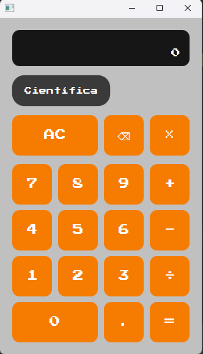
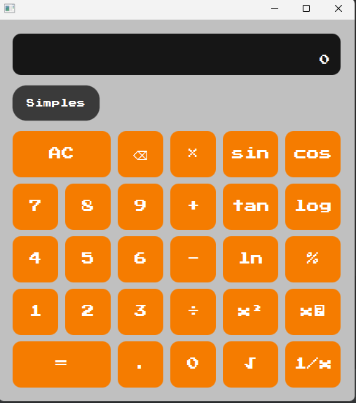

# Scientific Calculator

Uma calculadora científica desenvolvida em **Java** com **JavaFX**, criada como projeto de prática para aprofundar conhecimentos em desenvolvimento de aplicações desktop, Maven, FXML e organização de código.

## 📋 Sobre o projeto

O **Scientific Calculator** possui dois modos de utilização:

- **Modo Simples** — operações matemáticas básicas.
- **Modo Científico** — operações matemáticas e funções científicas adicionais.

A aplicação utiliza um estado compartilhado entre os dois modos, permitindo alternar entre as interfaces sem perder os dados atuais da calculadora.

## ⚙️ Funcionalidades

### Calculadora simples

- Adição
- Subtração
- Multiplicação
- Divisão
- Números decimais
- Separador de milhares
- Botão de limpar (`AC`)
- Botão de apagar (`⌫`)
- Operações encadeadas

### Calculadora científica

- Potenciação ao quadrado (`x²`)
- Potenciação (`xʸ`)
- Raiz quadrada (`√`)
- Inverso (`1/x`)
- Seno (`sin`)
- Cosseno (`cos`)
- Tangente (`tan`)
- Logaritmo na base 10 (`log`)
- Logaritmo natural (`ln`)
- Porcentagem (`%`)

### Tratamento de erros

A aplicação também trata operações inválidas, como:

- Divisão por zero
- Raiz quadrada de número negativo
- Logaritmo de zero ou número negativo
- Inverso de zero

## 🛠️ Tecnologias utilizadas

- **Java 21**
- **JavaFX**
- **FXML**
- **CSS**
- **Maven**
- **Git**

## 📁 Estrutura do projeto

```text
ScientificCalculator/
├── src/
│   ├── main/
│   │   ├── java/
│   │   │   └── com/
│   │   │       └── gustavo/
│   │   │           └── calculator/
│   │   │               ├── controller/
│   │   │               ├── model/
│   │   │               └── MainApp.java
│   │   │
│   │   └── resources/
│   │       ├── css/
│   │       ├── fonts/
│   │       ├── fxml/
│   │       ├── images/
│   │
│   └── test/
│
├── pom.xml
└── README.md
```
## 🚀 Como executar

### 📋 Pré-requisitos

Antes de executar o projeto, certifique-se de ter instalado:

- [Java JDK 21](https://www.oracle.com/java/technologies/downloads/)
- [Maven](https://maven.apache.org/)
- Uma IDE compatível com Java, como [IntelliJ IDEA](https://www.jetbrains.com/idea/)

### 📥 Clonando o repositório

```bash
git clone https://github.com/GustavoJ-dev/ScientificCalculator.git
```

Entre na pasta do projeto:

```bash
cd ScientificCalculator
```

### ▶️ Executando a aplicação

Utilize o Maven para executar o projeto:

```bash
mvn javafx:run
```

---

## 🎨 Interface

A aplicação possui dois modos de calculadora, permitindo alternar entre a interface simples e a científica.

### 🔢 Modo Simples



### 🔬 Modo Científico


---

## 📚 Objetivo do projeto

Este projeto foi desenvolvido com foco em **prática e aprendizado**, buscando aplicar conceitos de desenvolvimento Java 
em uma aplicação gráfica funcional.

Durante o desenvolvimento foram praticados:

- ☕ Java
- 🎨 JavaFX
- 📄 FXML
- 🎨 CSS
- 📦 Maven
- 🎯 Programação Orientada a Objetos
- 🖱️ Manipulação de eventos
- 🔄 Gerenciamento de estado
- ➕ Operações matemáticas
- ⚠️ Tratamento de exceções
- 📝 JavaDoc
- 🌱 Git e GitHub

---

## 🧠 Conceitos aplicados

### 🔄 Estado compartilhado

A aplicação utiliza uma classe `CalculatorState` para armazenar informações como:

- Primeiro operando
- Operador atual
- Resultado
- Expressão
- Estado do próximo operando

Isso permite que os modos **Simples** e **Científico** compartilhem o mesmo estado durante a troca de interface.

### 🎨 Separação da interface

As interfaces são definidas separadamente utilizando FXML:

```text
SimpleCalculator.fxml
ScientificCalculator.fxml
```

O controlador `CalculatorController` gerencia as interações entre a interface e a lógica da calculadora.

---

## 📖 Documentação

O código-fonte possui **JavaDoc** para documentar as principais classes e métodos da aplicação.

---

## 🔮 Próximas melhorias

Possíveis melhorias futuras para o projeto:

- [ ] Adicionar testes automatizados com JUnit
- [ ] Melhorar o tratamento de operações matemáticas
- [ ] Adicionar novas funções científicas
- [ ] Melhorar a experiência de utilização da interface
- [ ] Adicionar histórico de cálculos

---

## 👨‍💻 Autor

### Gustavo Silva

Desenvolvedor Java, com foco em **Java Backend** e no ecossistema Spring.

[](https://github.com/GustavoJ-dev)

[](https://www.linkedin.com/in/gustavo-silva-a92b33372/)

---
